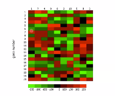

- Bunch of numbers, usually in table format

# heatmaps
- Heatmaps are ubiquitous in datascience
- Allows visualization of array-like data

# Clustering
- hierarchical clustering
- k-means

# Median

