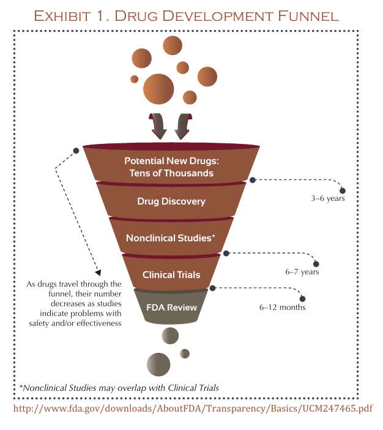
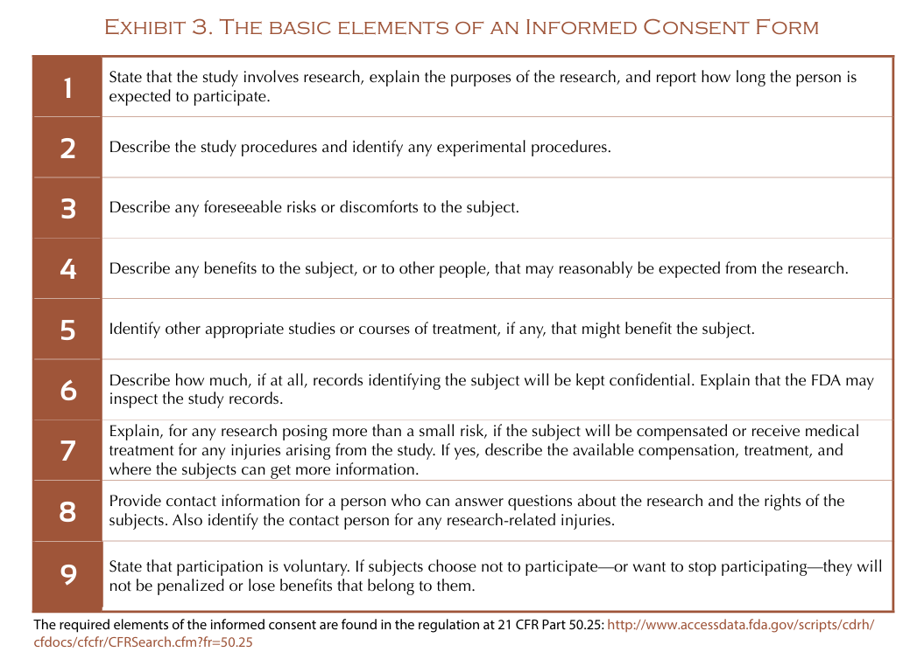
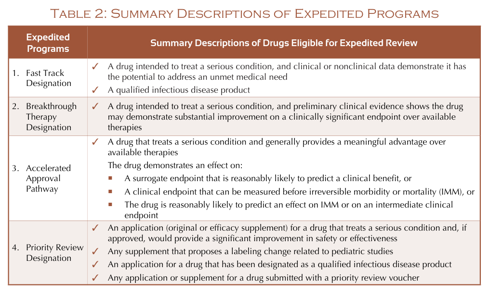

# Getting a Drug to market

{.center}

## Development Steps for NME

- New molecular entity (NME)

### Submitting an IND (investigational New Drug)

- Allows drugs to be moved across state lines for testing

- Must provide information about:
  - Animal studies
  - Chemistry, Manufacturing and controls (CMC)
  - Clinical protocols and investigator information
  - Informed consent (reporting of potential adverse effects)

The IND application is submitted to the office of new drugs (OND) which is a
subsidiary of the center for Drug evaluation and research (CDER).

In addition, the IND is submitted to an institutional review board (IRB) which
reviews the informed consent documents. It is a panel of scientists and
non-scientists.

- IND will be responded to by the FDA within 30 days
  - Safe to proceed
  - Clinical hold (not safe to proceed)
  - Partial hold (safe to proceed with limitations)

#### Informed consent

- ongoing and interactive
- needs to be easy to understand for the lay-person

{.center}

### Phase 1 Trial

- required to report suspected fatal reaction no later than 7 days to FDA
- report any other significant adverse effect within 15 days
- Annual progress reports within 60 days of anniversary of the study
- need to submit study report summarizing results at the end of the study

### Phase 2 trial

- Submit phase 2 protocol
- End of phase 2-A meeting allows one to receive input about the study from the
  FDA
- End of phase 2 meeting before the beginning of phase 3
- within 60 days of EOP2 meeting, pediatric study plan
- prior to the meeting submit a meeting package

### Phase 3 trial

- once agreed upon, it is a binding agreement with the FDA
- pivotal
- adequate and well-controlled investigations
- multiple controlled trials are required
- same reports as phase 1 and 2 are required

### Submission of the New Drug application (NDA)

- pre-NDA meeting allows one to resolve any remaining issues, reducing delays
  with FDA reviews
- Need to pay a user fee with the NDA to support timely reviews, though you can
  get a fee waiver sometimes

- is the drug safe and effective?
- is the drug of adequate quality

#### Risk evaluation and mitigation strategy (REMS)

- Needed when risks are high
  - large population
  - serious disease
  - duration
  - expected benefit
  - potential effects
  - type of drug

#### FDA 60 day notification

- FDA will tell you if the application is complete within 60 days
- FDA will halt a review and take a "refuse to file" action if there is a
  problem requiring a resubmission
- FDA may ask for information during the review
- FDA will conduct investigations if they deem the potential drug to be out of
  the ordinary or potentially unsafe
- FDA may use an advisory committee

#### FDA letters

- Approval letter allows one to market and sell a new drug
- Complete response letter details why a drug was not approved and what issues
  need to be resolved before it can be approved

#### Speeding up the review process

- Unmet medical need
- Serious condition 

#### Recap (meetings)

- type A meetings are used to restart a stalled development program
- type B meetings are milestone advice meetings
- type C meetings are any meeting other than type A or B

### Post-Approval Activities

- Continuing obligation to report any new safety information that comes to light
