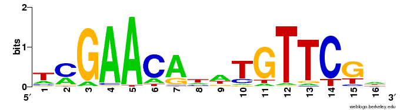

 A DNA motif is a sequence frequency description for a
particular region of DNA that appears frequently, either across species
(sequence comparison) or for particular binding sites (as in [[ChiPSeq]]).

Motifs can be used to identify relationships between different proteins or
[[transcription-factor]]s that bind to DNA.
